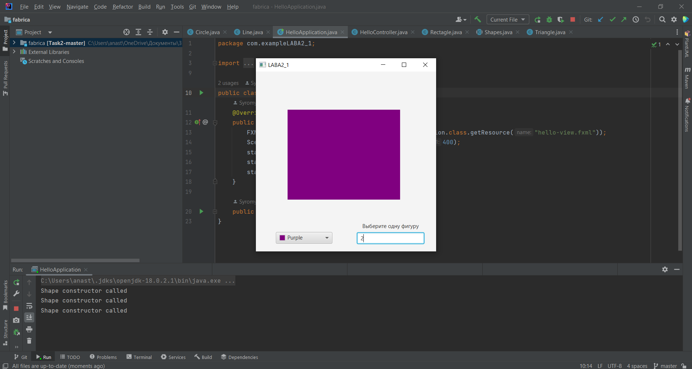

# Task2.2

## В ходе практической работы были реализованны:
- Абстрактный супер класс Shapes
- - Абстрактный метод Draw, класса Shapes
- Класс Line, наследующий класс Shapes, который контроллирует логическое выполнение рисования линии 
- Класс Rectagle, наследующий класс Shapes, который контроллирует логическое выполнение рисования квадрата 
- Класс Triagle, наследующий класс Shapes, который контроллирует логическое выполнение рисования треугольника 
- Класс Circle, наследующий класс Shapes, который контроллирует логическое выполнение рисования круга
- Был реализован фабричный метод
 
